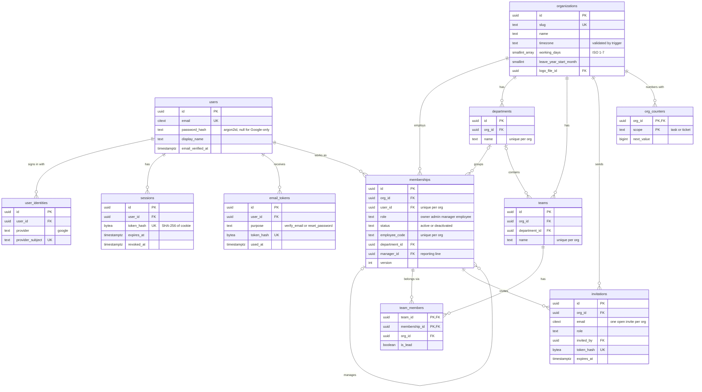
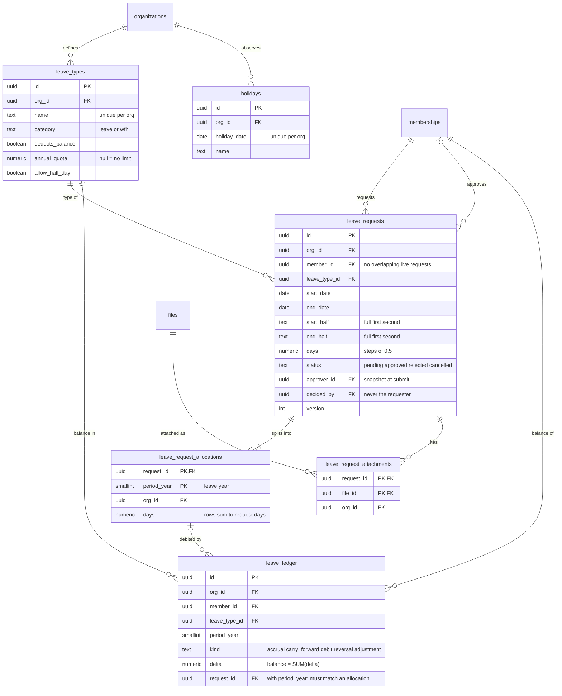
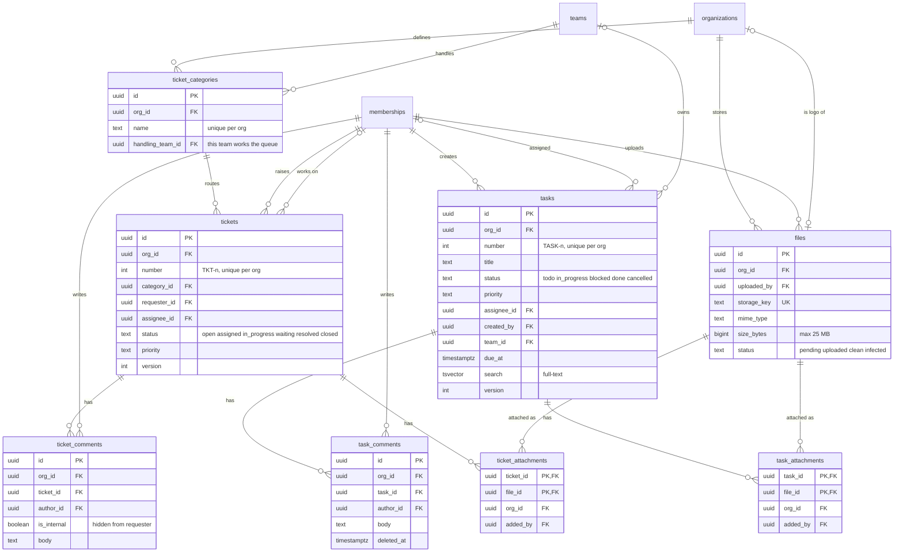
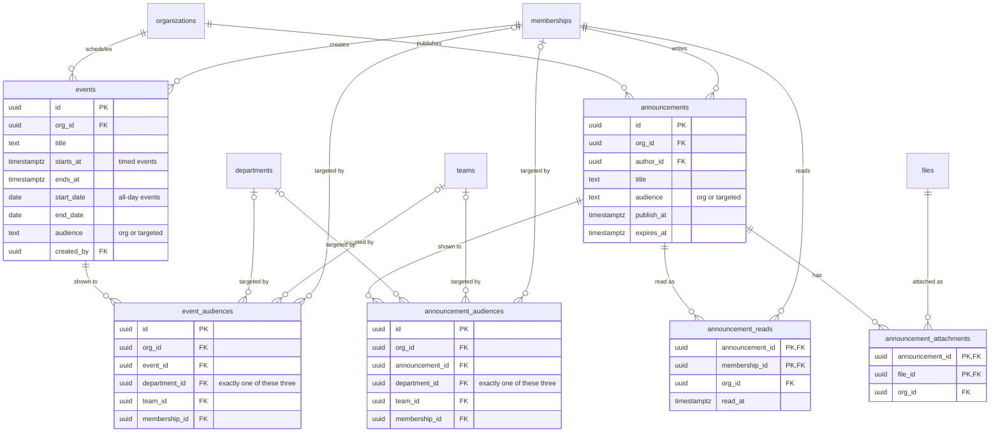
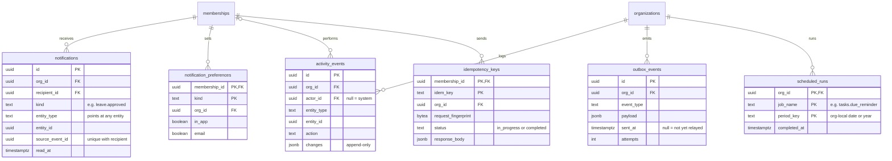

# OpsFlow V1 · ER diagrams by module

Generated from `opsflow-erd.mermaid` (the full diagram). Tables shown with only a name are owned by another module.
Every tenant table also has `org_id` to `organizations`; child tables inherit that edge from their parent.

## Identity, organization and people

Login identities are global; everything a person does inside a company hangs off their membership in that company.

## Leave and WFH

Each request is split into per-leave-year allocations at submission. Approval writes one debit per allocation to the append-only ledger, and a balance is the sum of the ledger for that year.

## Tasks, tickets and files

Tickets route to a category, and the category names the team whose members work the queue.

## Calendar and announcements

An event or announcement is either for the whole company or targeted; each targeted audience row names exactly one department, team or person.

## Platform: notifications, activity, outbox

activity_events and notifications point at any entity through entity_type + entity_id, so they carry no foreign key to tasks, tickets or leave.

